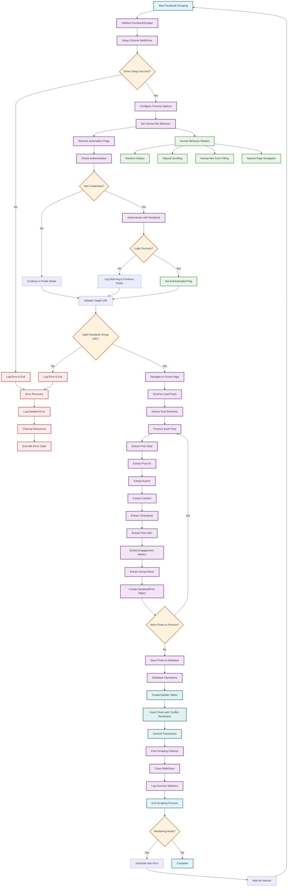

# Facebook Public Group Post Scraper

A Python package that monitors Facebook public groups for new posts and saves them to a local database. The scraper can run continuously and check for new posts at regular intervals.

## 🚀 New in Version 3.0: Complete Refactoring with Strategy Pattern

The scraper has been completely refactored with a clean, modular architecture following the Strategy Pattern:

- **Strategy Pattern**: `BaseScraper` defines the interface for all scrapers
- **Separation of Concerns**: Database operations are separated into `DatabaseManager`
- **Configuration Management**: All configuration is centralized in the `config` package
- **Model-Driven**: Data structures are defined in separate model classes
- **Extensibility**: Easy to create new scrapers for other platforms
- **Clean Architecture**: Clear folder structure with logical separation

## Project Structure

```
facebook_scraping/
├── config/                     # Configuration package
│   ├── __init__.py            # Package initialization
│   ├── config.py              # Chrome configuration utilities
│   └── legacy_config.py       # Backward compatibility
├── database/                   # Database package
│   ├── __init__.py            # Package initialization
│   ├── database.py            # Database operations manager
│   └── models.py              # Data models and structures
├── strategies/                 # Scraping strategies package
│   ├── __init__.py            # Package initialization
│   ├── base_scraper.py        # Abstract base class for all scrapers
│   ├── facebook_scraper.py    # Facebook-specific scraper implementation
│   └── google_scraper.py      # Google search scraper for testing
├── tests/                      # Test suite
│   ├── __init__.py            # Test package initialization
│   ├── conftest.py            # Test configuration and fixtures
│   ├── test_refactored_architecture.py  # Main architecture tests
│   ├── test_config.py         # Configuration tests
│   ├── test_lib.py            # Library function tests
│   └── README.md              # Test documentation
├── main.py                     # Main entry point (refactored)
├── quick_start_refactored.py  # Interactive setup script (refactored)
├── config.py                   # Backward compatibility config
├── requirements.txt            # Python dependencies
└── README.md                   # This file
```

## Features

- 🔍 **Continuous Monitoring**: Automatically checks for new posts at configurable intervals
- 💾 **Database Storage**: Saves posts to SQLite database with duplicate prevention
- 📊 **Rich Data Extraction**: Captures post content, author, timestamps, engagement metrics
- 🔐 **Optional Login**: Can use Facebook credentials for better access to private groups
- 📤 **Data Export**: Export collected posts to JSON format
- 🛡️ **Anti-Detection**: Uses rotating user agents and stealth browser options
- 📝 **Comprehensive Logging**: Detailed logs for monitoring and debugging
- 🏗️ **Strategy Pattern**: Clean separation of concerns with abstract base classes
- 🔌 **Extensible Design**: Easy to create scrapers for other platforms
- 🗄️ **Independent Database Layer**: Database operations can be used independently
- ⚙️ **Centralized Configuration**: All configuration in one place

## Architecture Benefits

### Before (Monolithic)
- Single large class handling everything
- Database operations mixed with scraping logic
- Hard to extend for other platforms
- Difficult to test individual components
- Configuration scattered throughout code

### After (Strategy Pattern)
- Abstract base class defines scraper interface
- Separate database manager for data operations
- Centralized configuration management
- Clean inheritance hierarchy
- Easy to test and extend
- Platform-agnostic design
- Clear folder structure

## Prerequisites

- Python 3.7 or higher
- Chrome browser installed
- Internet connection

## Chrome Configuration

The scraper automatically detects Chrome and ChromeDriver installations. You can also manually specify paths in your `.env` file:

- **CHROME_DRIVER_PATH**: Path to ChromeDriver executable
- **CHROME_BINARY_PATH**: Path to Chrome browser binary
- **CHROME_HEADLESS**: Set to `false` to run Chrome in visible mode

### Auto-detection

The scraper will automatically search for Chrome and ChromeDriver in common locations:
- **macOS**: `/Applications/Google Chrome.app/Contents/MacOS/Google Chrome`
- **Windows**: `C:\Program Files\Google\Chrome\Application\chrome.exe`
- **Linux**: `/usr/bin/google-chrome`

If no local ChromeDriver is found, it will automatically download one using `webdriver_manager`.

## Installation

1. **Clone or download the project files**

2. **Install required dependencies**:
   ```bash
   pip install -r requirements.txt
   ```

3. **Set up configuration**:
   ```bash
   cp config.env.example .env
   ```
   
   Edit the `.env` file with your settings:
   ```env
   # Required: Facebook group URL
   FACEBOOK_GROUP_URL=https://www.facebook.com/groups/YOUR_GROUP_ID/
   
   # Optional: Facebook credentials (for better access)
   FACEBOOK_EMAIL=your_email@example.com
   FACEBOOK_PASSWORD=your_password
   
   # Configuration
   CHECK_INTERVAL_MINUTES=30
   MAX_POSTS_PER_CHECK=20
   HEADLESS=true
   
   # Chrome Configuration (optional - will auto-detect if not specified)
   CHROME_DRIVER_PATH=
   CHROME_BINARY_PATH=
   CHROME_HEADLESS=true
   ```

## Usage

### Basic Usage (Refactored)

Run the scraper with the new refactored architecture:

```bash
python main.py --group-url "https://www.facebook.com/groups/YOUR_GROUP_ID/"
```

### Quick Start (Refactored)

Use the interactive setup script:

```bash
python quick_start_refactored.py
```

### Testing

Run the test suite to verify everything works:

```bash
# Install pytest if not already installed
pip install pytest

# Run all tests with pytest
pytest

# Run tests with verbose output
pytest -v

# Run specific test file
pytest tests/test_refactored_architecture.py

# Run tests matching a pattern
pytest -k "test_imports"

# Run tests with coverage (if pytest-cov is installed)
pytest --cov=strategies --cov=database --cov=config

# Run with Python's unittest module (alternative)
python -m unittest discover tests/
```

### Advanced Usage

You can also use the scraper programmatically with the new architecture:

```python
from strategies.facebook_scraper import FacebookScraper
from database.database import DatabaseManager

# Initialize scraper
scraper = FacebookScraper()

# Setup browser
scraper.setup_driver(headless=True)

# Optional: Authenticate with Facebook
credentials = {'email': 'your_email@example.com', 'password': 'your_password'}
scraper.authenticate(credentials)

# Monitor a group
scraper.monitor_group(
    group_url="https://www.facebook.com/groups/YOUR_GROUP_ID/",
    interval_minutes=30,
    max_posts=20
)

# Export data
scraper.save_posts_to_json("my_posts.json")

# Clean up
scraper.close()
```

### One-time Scraping

If you just want to scrape posts once without continuous monitoring:

```bash
python main.py --group-url "https://www.facebook.com/groups/YOUR_GROUP_ID/" --mode scrape --max-posts 50
```

### Using Context Manager

```python
from strategies.facebook_scraper import FacebookScraper

with FacebookScraper() as scraper:
    scraper.setup_driver()
    # ... scraping operations ...
    # Automatically cleaned up when exiting context
```

### Google Scraper for Testing

The package now includes a Google scraper for testing purposes:

```python
from strategies.google_scraper import GoogleScraper

# Initialize Google scraper
scraper = GoogleScraper()

# Setup driver and authenticate
scraper.setup_driver(headless=False)
scraper.authenticate({})  # No credentials needed for Google

# Search and scrape results
results = scraper.search_and_scrape("Python web scraping", max_results=10)

# Process results
for result in results:
    print(f"Title: {result.content.split('\n')[0]}")
    print(f"URL: {result.post_url}")
    print(f"Source: {result.author}")

# Clean up
scraper.close()
```

**Features of Google Scraper:**
- 🔍 **Search Results**: Scrapes Google search results
- 📱 **No Authentication**: Works without login credentials
- 🎯 **Configurable Results**: Set maximum number of results to scrape
- 🖥️ **Browser Control**: Can run in headless or visible mode
- 📊 **Rich Data**: Extracts titles, URLs, snippets, and source domains
- 🧹 **Auto Cleanup**: Handles cookie dialogs and page setup automatically

### Database Operations Only

```python
from database.database import DatabaseManager

with DatabaseManager("posts.db") as db:
    # Get all posts
    posts = db.get_posts()
    
    # Get posts by group
    group_posts = db.get_posts_by_group("My Group")
    
    # Export to JSON
    db.export_to_json("export.json")
```

## Configuration Options

| Environment Variable | Default | Description |
|---------------------|---------|-------------|
| `FACEBOOK_GROUP_URL` | - | **Required**: URL of the Facebook group to monitor |
| `FACEBOOK_EMAIL` | - | Facebook login email (optional) |
| `FACEBOOK_PASSWORD` | - | Facebook login password (optional) |
| `CHECK_INTERVAL_MINUTES` | 30 | How often to check for new posts (minutes) |
| `MAX_POSTS_PER_CHECK` | 20 | Maximum number of posts to check per run |
| `HEADLESS` | true | Run browser in headless mode (true/false) |

## Data Structure

Each scraped post contains the following information:

```python
@dataclass
class FacebookPost:
    post_id: str          # Unique post identifier
    author: str           # Post author name
    content: str          # Post text content
    timestamp: str        # When the post was published
    likes_count: int      # Number of likes
    comments_count: int   # Number of comments
    shares_count: int     # Number of shares
    post_url: str         # Direct link to the post
    group_name: str       # Name of the Facebook group
    scraped_at: str       # When the post was scraped
    metadata: Dict        # Additional metadata
```

## Database Schema

Posts are stored in a SQLite database (`facebook_posts.db`) with the following structure:

```sql
CREATE TABLE posts (
    id INTEGER PRIMARY KEY AUTOINCREMENT,
    post_id TEXT UNIQUE,
    author TEXT,
    content TEXT,
    timestamp TEXT,
    likes_count INTEGER,
    comments_count INTEGER,
    shares_count INTEGER,
    post_url TEXT,
    group_name TEXT,
    scraped_at TEXT,
    created_at TIMESTAMP DEFAULT CURRENT_TIMESTAMP
);
```

## Output Files

- `facebook_posts.db`: SQLite database containing all scraped posts
- `scraped_posts.json`: JSON export of all posts (when using export function)
- `facebook_scraper.log`: Detailed log file with scraping activities

## Creating New Scrapers

To create a scraper for a new platform using the Strategy Pattern:

1. Inherit from `BaseScraper`
2. Implement all abstract methods
3. Create platform-specific data models
4. Use the existing `DatabaseManager` or create a new one

```python
from strategies.base_scraper import BaseScraper, ScrapedPost

class TwitterScraper(BaseScraper):
    def __init__(self):
        super().__init__(name="TwitterScraper")
    
    def setup_driver(self, **kwargs) -> bool:
        # Implement Twitter-specific driver setup
        pass
    
    def authenticate(self, credentials: Dict[str, str]) -> bool:
        # Implement Twitter authentication
        pass
    
    def scrape_posts(self, target_url: str, max_posts: int = 20) -> List[ScrapedPost]:
        # Implement Twitter post scraping
        pass
```

## Migration from Old Version

The refactored version maintains backward compatibility for most operations:

- `FacebookScraper` class still exists with the same interface
- Database operations work the same way
- All existing functionality is preserved

Key changes:
- `login_to_facebook()` → `authenticate()`
- `scrape_group_posts()` → `scrape_posts()`
- Database operations now use `DatabaseManager` internally
- Configuration is centralized in the `config` package

## Important Notes

### Legal and Ethical Considerations

⚠️ **Important**: This tool is for educational and research purposes only. Please ensure you:

1. **Respect Facebook's Terms of Service**
2. **Only scrape public groups** that you have permission to access
3. **Don't overload Facebook's servers** - use reasonable intervals
4. **Respect user privacy** - don't collect personal information
5. **Comply with local laws** regarding data collection and privacy

### Technical Limitations

- Facebook's layout changes frequently, so selectors may need updates
- Some groups may have anti-scraping measures
- Rate limiting may occur with frequent requests
- Private groups require login credentials

### Troubleshooting

**Common Issues:**

1. **"No posts found" error**:
   - Check if the group URL is correct
   - Try running with `--headless=false` to see what's happening
   - The group might be private and require login

2. **Login failures**:
   - Ensure credentials are correct
   - Facebook might require 2FA or additional verification
   - Try running without login for public groups

3. **Chrome driver issues**:
   - Make sure Chrome browser is installed
   - The script automatically downloads the correct driver version

4. **Rate limiting**:
   - Increase `CHECK_INTERVAL_MINUTES` to reduce frequency
   - Facebook may temporarily block requests if too frequent

## Contributing

Feel free to submit issues and enhancement requests!

## License

This project is for educational purposes. Use responsibly and in compliance with Facebook's Terms of Service and applicable laws. 

## Facebook Scraping Flowchart



### Flow Description

The Facebook scraping process follows this comprehensive workflow:

1. **Initialization**: Creates FacebookScraper instance with database manager
2. **Driver Setup**: Configures Chrome WebDriver with anti-detection measures
3. **Authentication**: Optional Facebook login for enhanced access
4. **URL Validation**: Ensures target is a valid Facebook group
5. **Content Extraction**: Navigates and scrolls to load posts
6. **Data Processing**: Extracts structured data from each post
7. **Database Storage**: Saves posts with conflict resolution
8. **Cleanup**: Closes resources and logs statistics
9. **Monitoring**: Optional continuous monitoring with scheduling

The system integrates human behavior simulation to avoid detection and includes comprehensive error handling throughout the process. 